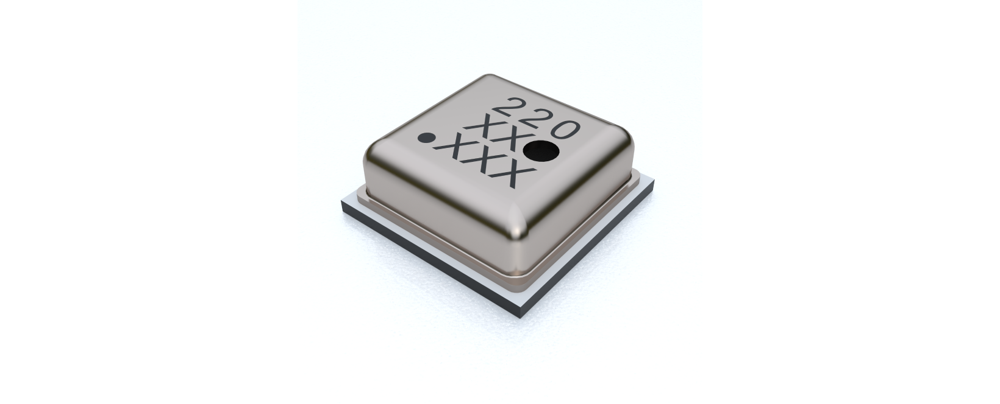
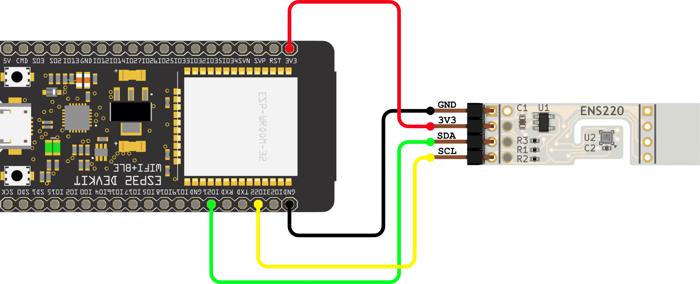
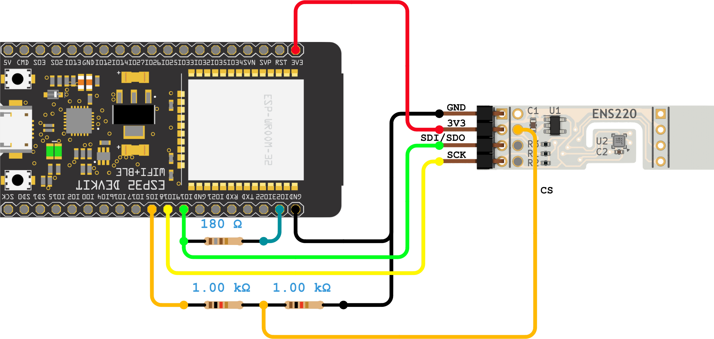

# ScioSense ENS220 Arduino Library
Arduino library for the ENS220 high-accuracy barometric pressure and temperature sensor.

The ENS220 is an ultra-low-power, high-accuracy barometric pressure and temperature sensor produced by
[ScioSense](http://www.sciosense.com). It comes in the smallest size LGA package with digital I2C and SPI interfaces. 
This enables new use cases in activity tracking, indoor navigation/localization, fall- and liquid-level detection.

## Links
* [Datasheet](https://www.sciosense.com/wp-content/uploads/2023/12/ENS220-Datasheet.pdf)
* Application notes 
  - [Event Detection](https://www.sciosense.com/wp-content/uploads/2024/04/ENS220-Application-Note-Indoor-Event-Detection.pdf)
  - [Fall Detection](https://www.sciosense.com/wp-content/uploads/2024/04/ENS220-Application-Note-Fall-Detection.pdf)
* Buy the ENS220 on [Mouser](https://mou.sr/3K2wfLJ) or [Digikey](https://www.digikey.nl/en/products/detail/sciosense/ens220s-bglt/21278457)
* Buy the ENS220 evaluation kit on [Mouser](https://mou.sr/3PQWatb)
* [Further information about the ENS220](https://www.sciosense.com/ens220-barometric-pressure-and-temperature-sensor/)

 
## Prerequisites
It is assumed that
 - The Arduino IDE has been installed.
   If not, refer to "Install the Arduino Desktop IDE" on the
   [Arduino site](https://www.arduino.cc/en/Guide/HomePage).
- The library directory is at its default location. Normally this is `C:\Users\[your_username]\Documents\Arduino\libraries`.

You might need to add your board to the Arduino IDE. This library was tested with the [Espressif ESP32](https://www.espressif.com/en/products/socs/esp32). 
For the installation of the ESP32 in the Arduino IDE, see [Arduino ESP32 Installation](https://docs.espressif.com/projects/arduino-esp32/en/latest/installing.html)

## Installation

### Installation via Arduino Library Manager
- In the Arduino IDE, navigate to the Arduino Library Manager on the left side (or, alternatively, select Sketch > 
Include Library > Manage Libraries...)
- Search for `ScioSense_ENS220`
- Select the library from the search results and press `Install`

### Manual installation
- Download the code from this repository via "Download ZIP".
- In Arduino IDE, select Sketch > Include Library > Add .ZIP library... and browse to the just downloaded ZIP file.
- When the IDE is ready this README.md should be located at `C:\Users\[your_username]\Documents\Arduino\libraries\ScioSense_ENS220\README.md`.

## Wiring

### General
Please make sure that you use the correct supply voltage:
- The ENS220 runs at VDD = 1.8 V. If you are using the Sciosense ENS220 breakout board, you can use VDD = 3.3 V thanks
to the onboard LDO. 
- The I2C communication is 3.3 V tolerant.

### Example with ESP32 (I2C)
This example shows how to wire a [ESP32DevKitC](https://docs.espressif.com/projects/esp-idf/en/latest/esp32/hw-reference/esp32/get-started-devkitc.html#get-started-esp32-devkitc-board-front) 
with the ENS220 breakout board for I2C communication.

| ENS220 breakout board | ESP32 |
|:---------------------:|:-----:|
|          VDD          |  3V3  |
|          GND          |  GND  |
|          SDA          |  G21  |
|          SCL          |  G22  |

### Example with ESP32 (SPI)
This example shows how to wire a [ESP32DevKitC](https://docs.espressif.com/projects/esp-idf/en/latest/esp32/hw-reference/esp32/get-started-devkitc.html#get-started-esp32-devkitc-board-front) 
with the ENS220 breakout board for SPI communication.

| ENS220 breakout board | ESP32 |
|:---------------------:|:-----:|
|          VDD          |  3V3  |
|          GND          |  GND  |
|          SDI          |  G23  |
|          SDO          |  G19  |
|          CSN          |  G05  |

### Interrupt functionality
To use the ENS220's interrupt functionality connect the interrupt pin of the ENS220 to a GPIO pin of your Arduino. The 
interrupt pin uses 1.8 V (logic level shifter might be required).

## Build an example
To build an example sketch
 - (Re)start Arduino.
 - Open File > Examples > Examples from Custom Libraries > ScioSense ENS220 > 01_Basic_I2C_SingleShot (or any other of the provided 
examples you wish to run)
 - Make sure Tools > Board lists the correct board.
 - Select Sketch > Verify/Compile.

## Contributing
Contributions in the form of issue opening or creating pull requests are very welcome!

## Acknowledgements
This library is developed for ScioSense by [at² GmbH](https://www.at2-software.com/en/) 

@at2software

### ScioSense is a Joint Venture of ams AG 
